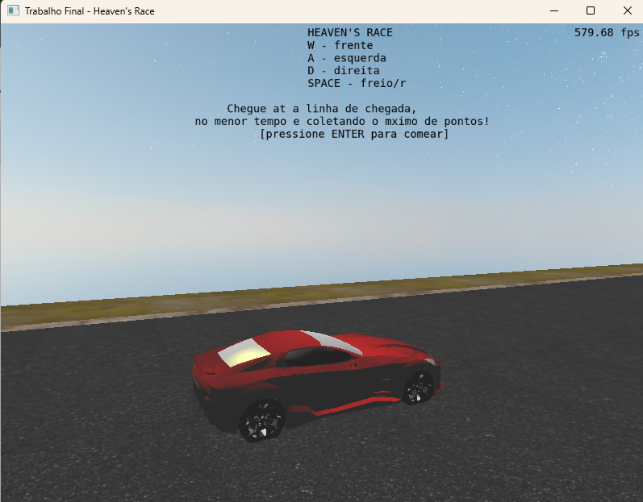
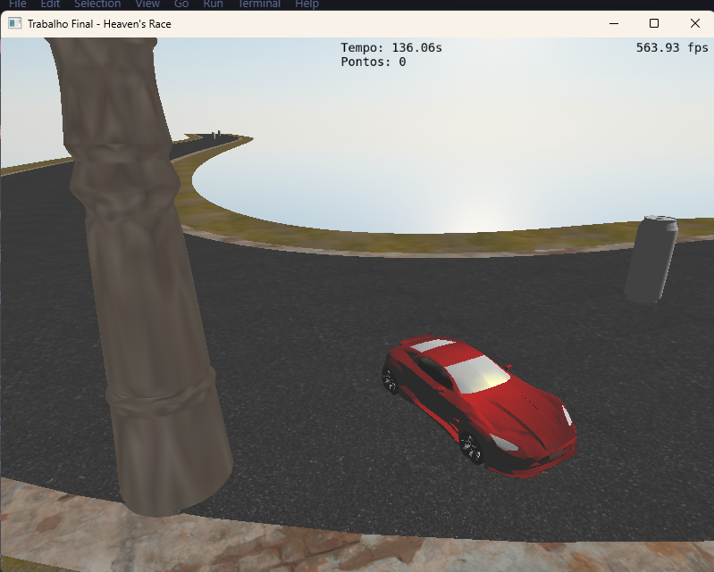

<h1 style="text-align: center; color: cyan;">H E A V E N's</h1>
<h1 style="text-align: center; color: cyan;">R A C E</h1>

> Trabalho final da Cadeira de Fundamentos de Computação Gráfica (INF0147). Implementação de um jogo tipo Mario Kart em C++ com OpenGL.

# Funcionalidade
Controlando um carro com as teclas AWD e SPACE, você deve coletar recursos, desviar de postes e chegar na linha de chagada no menor tempo, tudo isso enquanto admira a paisagem do céu.

# Como executar
Para executar, basta rodar o arquivo dentro da pasta *bin/Release/main.exe*.

# Requisitos básicos implementados
- **Importação de objetos com malhas complexas**@JoãoVitor: o carro foi um objeto encontrado na internet, com muitos vértices. Foi utilizado a ferramenta Blender para desagrupar os vertices e deixar grupos que faziam sentido para o jogo, como o corpo do carro e os vidros.
- **Iluminação de Blinn-Phong** @JoãoVitor: para a iluminação dos vidros do carro e dos pontos do jogo, foi utilizado o modelo Blinn-Phong.
- **Iluminação de Lambert** @JoãoVitor: para a iluminação da estrada, por exemplo, foi utilizado o modelo de iluminação de Lambert, além de em outros objetos.
- **Interpolação de Gouraud** @JoãoVitor: para o poste, foi utilizado interpolação de Gouraud no vertex shader. Para todo o resto foi utilizada interpolação de Phong.
- **Controle de câmeras virtuais** @JoãoVitor: existem várias câmeras disponiveis no jogo. Algumas look-at são travadas (para o inicio e para o fim), e quando o carro está andando sem o usuário clicar. Caso o usuário clique, a câmera look-at fica livre (é possível mexê-la). Há também a câmera livre, quando o usuário clica a tecla C, que parte de cima do carro.
- **Instâncias de objetos** @JoãoVitor: há obstáculos para desviar e itens para pegar, e ambos são instâncias de objetos repetidos.
- **Teste de intersecção entre objetos virtuais** @JoãoVitor: foram feitas colisões de três tipos: reta-plano (para a linha de chegada), AABB-cilindro (para os obstáculos) e AABB-esfera (para os itens).
- **Mapeamento de texturas** @JoãoVitor: Para as texturas, foram utilizadas imagens da internet. Para a pista do carro, as texturas foram projetadas com projeção planar. Para o corpo do carro, foi utilizada uma projeção cúbica. Há também uma imagem que define a textura do item do jogo, que é um monster, que veio junto com o .obj com coordenadas de textura.
- **Física do carro (proj. geométrica de objetos virtuais)** @Ricardo: foi feito o cálculo dos vetores de direção, velocidade e curva do carro, para que ele pudesse se deslocar utilizando o teclado. O carro tem a funcionalidade de derrapar, quando está muito rápido ou freiando.
- **Curvas de bézier**@JoãoVitor: a estrada da corrida é uma curva de bezier cúbica e piecewise. Seus pontos e tangentes são definidos no código e a curva é usada para criar os objetos que recebem a textura da estrada.
# Requisitos adicionais
- O céu utiliza um Cubemap em vez de uma projeção esférica. Para isso, utilizou-se 6 faces (imagens) e uma função pré-pronta, com auxilio da IA.

# Outros
### Desafios (problemas resolvidos)
- Lidar com blender e com vértices agrupados por material. Tivemos que ver quais vértices estavam relacionados ao material do vidro do carro, para agrupar e considerar ele como um objeto à parte na cena virtual;
- Pista com curva de bezier: dificultou bastante o check para validar se o carro estava dentro da pista, o que não ficou perfeito no final;
- AABB errado da roda: para a roda do carro, quisemos fazer um mapeamento das texturas normalizado, mas isso não foi possível visto que isso resultava em uma imagem esticada, já que havia um vértice que deixava o bounding-box da roda gigante. Para resolver, fizemos uma projeção planar de modo empírico.
- Como quisemos fazer uma física do carro mais realista, isso trouxe vários problemas, como por exemplo fazer ele derrapar quando estivermos freiando.

### Uso de IA no desenvolvimento
Para ajudar no trabalho, utilizamos a IA generativa da Open IA, Chat GPT. Ela foi útil para fazer debug e entender problemas principalmente na geração da pista de curva de bezier. Houve também uso para as funções para colisões e encontrar problemas, principalmente na colisão com a pista.

Foi útil quando se explicava exatamente o propósito, o contexto inteiro, e qual era o resultado esperado. A IA, quando com recursos necessários, trazia ideias boas para resolver os problemas. Como por exemplo a ideia de calcular a distância do carro até a curva de bezier para saber se ele está dentro da pista.

